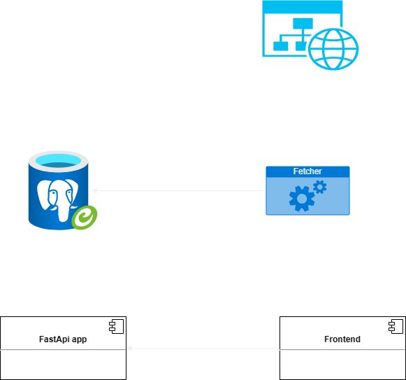

# Israel Flights Tracker

This project is designed to fetch and display real-time flight information for flights in and out of Israel. It consists of a backend API built with FastAPI, a frontend built with Streamlit, a PostgreSQL database for storing flight data, and a Python script that fetches flight data periodically.

## High level architecture



## Project Structure

- `./backend` - Contains the FastAPI application.
- `./frontend` - Contains the Streamlit application.
- `fetch_flights_periodically.py` - Python script to fetch flight data periodically.
- 
## End points:
Certainly! Here's a breakdown of the endpoints in the FastAPI backend and what each of them does:

1. GET `/flights`
   - Retrieves a list of flights.
   - Returns the flight data in the format specified by the `Flight` model.

2. GET `/peak_hours`
   - Retrieves the peak hours of flight departures for the current day.
   - Returns the peak hours as a list of tuples, where each tuple contains the hour and the count of flights departing in that hour.

3. GET `/flight_status_counts`
   - Retrieves the count of flights for each flight status (e.g., "DEPARTED", "LANDED", "NOT FINAL", etc.).
   - Returns the flight status counts as a list of dictionaries, where each dictionary contains the flight status and its count.

4. GET `/top_airlines`
   - Retrieves the top airlines based on the number of flights operated by each airline.
   - Returns the top airlines as a list of dictionaries, where each dictionary contains the airline name and the count of flights operated by that airline.

5. GET `/busiest_routes`
   - Retrieves the busiest routes based on the number of flights to each destination.
   - Returns the busiest routes as a list of dictionaries, where each dictionary contains the destination name and the count of flights to that destination.

6. GET `/daily_average_delay`
   - Calculates the daily average delay for flights on the current day.
   - Returns the daily average delay in minutes as a JSON response.

7. GET `/weekly_average_delay`
   - Calculates the weekly average delay for flights in the current week.
   - Returns the weekly average delay in minutes as a JSON response.

These endpoints provide various flight-related information such as the list of flights, peak hours, flight status counts, top airlines, busiest routes, and average delays. You can access these endpoints by making HTTP GET requests to the corresponding URLs.
## Prerequisites

- Docker and Docker Compose installed on your machine.

## Installation

Apologies for the confusion. To clone the repository and start the project using Docker Compose, follow these steps:

1. Open a terminal or command prompt.

2. Change to the directory where you want to clone the repository by using the `cd` command. For example, to change to your home directory:
   ```shell
   cd ~
   ```

3. Clone the repository using the following command:
   ```shell
   git clone https://github.com/EASS-HIT-PART-A-2022-CLASS-III/IsraelFlights.git
   ```

4. Change to the project directory:
   ```shell
   cd IsraelFlights
   ```

5. Build and start all services using Docker Compose:
   ```shell
   docker-compose up --build -d
   ```

   This command will build the Docker images for the backend and frontend, start the containers, and run them in the background (`-d` flag).

6. Wait for the containers to start up. This may take a few moments as the necessary dependencies are downloaded and installed.

7. Once the containers are up and running, you can access the applications:
   - The FastAPI backend can be accessed at http://localhost:8000.
   - The Streamlit frontend can be accessed at http://localhost:8501.

You should now have the project running locally using Docker Compose.

## Accessing the Applications
* The FastAPI backend can be accessed at http://localhost:8000.
* The Streamlit frontend can be accessed at http://localhost:8501.

## Environment Variables
The following environment variables are used in this project:

* DATABASE_URL: The connection string for the PostgreSQL database.
* BASE_URL: The base URL for the backend API.
* POSTGRES_PASSWORD: The postgres password

# Video
[](https://www.youtube.com/watch?v=EWXSPHQQCF0 "Israel Flights Tracker")

